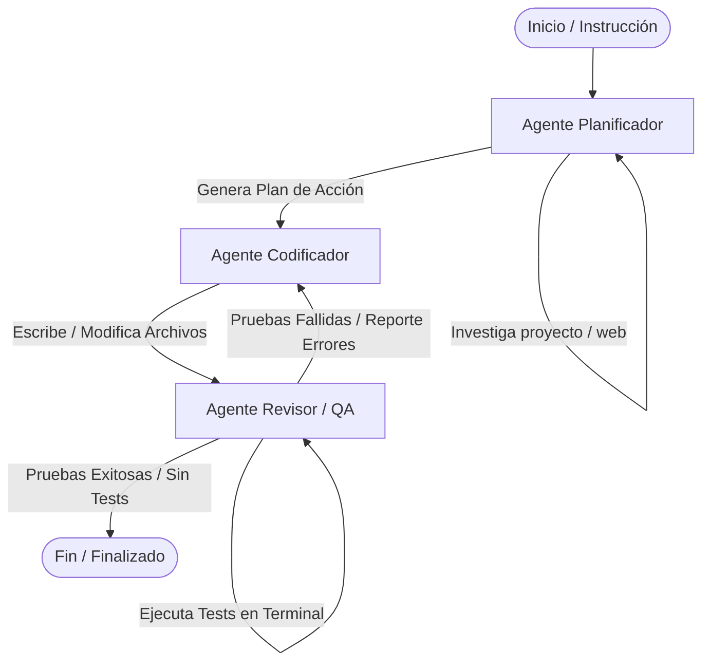

# Copilot Support - Sistema Multiagente de Desarrollo de Software

Un sistema autónomo multiagente para el desarrollo, refactorización y prueba de software de manera iterativa. Basado en **LangGraph**, servidor **MCP (Model Context Protocol)** por SSE (Server-Sent Events), soporte multiproveedor de LLM (Google Gemini y OpenAI) con resiliencia y fallback automático, e interfaz CLI interactiva construida con **Rich**.

---

## 🚀 Características Principales

- **Orquestación Multiagente con LangGraph**: Flujo de trabajo cíclico y directed por estados (`ProjectState`) compuesto por tres agentes autónomos especializados: **Planificador**, **Codificador** y **Revisor/Tester**.
- **Servidor MCP con Transporte SSE**: Integración estandarizada bajo el Model Context Protocol sobre transporte SSE (Server-Sent Events) en FastAPI (`mcp.server.fastmcp`), permitiendo ser consumido por clientes MCP como Claude Desktop, IDEs o servicios remotos.
- **LLM Factory Multiproveedor**:
  - Soporte nativo para **Google Gemini** (`gemini-2.5-flash`, `gemini-1.5-pro`) y **OpenAI** (`gpt-4o`, `gpt-4o-mini`).
  - **Mecanismo de Fallback Automático**: Si el proveedor primario falla (ej. problemas de API key o cuotas), el sistema conmuta sin interrupción al proveedor alternativo.
- **Interfaz CLI Interactiva con Rich**: Experiencia interactiva en terminal con formateo de consola, paneles coloridos, tablas de estado y loaders visuales.
- **Gestión Modular de Prompts**: Prompts definidos en archivos Markdown independientes (`prompts/`) con soporte de carga dinámica.
- **Resiliencia y Control de Ciclos Infinitos**:
  - Contadores de bucle integrados por agente (`loop_counter`).
  - Límite global de intentos de revisión de código (`revision_count <= 3`).
  - Detección automática de comandos redundantes en terminal.
  - Optimización dinámica de la ventana de contexto de mensajes.

---

## 🏗️ Arquitectura de Agentes

El flujo de trabajo está modelado como un **Grafo Dirigido en LangGraph**. Los agentes colaboran actualizando un estado compartido denominado `ProjectState`.



### 🧠 Componentes y Agentes

1. **Estado del Proyecto (`ProjectState`)**:
   - `messages`: Historial optimizado de interacción entre modelos y herramientas.
   - `directorio_proyecto`: Ruta raíz del código fuente bajo desarrollo.
   - `instruccion_usuario`: Requerimiento inicial o tarea a resolver.
   - `plan_de_accion`: Estructura generada por el planificador (`explicacion_arquitectura` y lista de `pasos` con bandera `requiere_test`).
   - `codigo_escrito`: Resumen de modificaciones de código realizadas.
   - `errores_terminal`: Salida de errores recopilados durante la ejecución de pruebas.
   - `loop_counter`: Control de iteraciones máximas por nodo.
   - `revision_count`: Contador de intentos de corrección del QA (máximo 3).

2. **Agente Planificador (`agente_planificador`)**:
   - **Misión**: Analizar los requerimientos y la estructura del proyecto objetivo.
   - **Herramientas**: Lectura de archivos (`read_file`, `list_directory`), búsqueda web en internet (`busqueda_web_duckduckgo`) y entrega de plan (`entregar_plan_de_accion`).
   - **Salida**: Genera un plan de acción técnico en formato JSON/Pydantic que detalla los archivos a modificar y si cada paso requiere o no pruebas unitarias.

3. **Agente Codificador (`agente_codificador`)**:
   - **Misión**: Implementar o modificar el código fuente según las especificaciones del plan.
   - **Herramientas**: `read_file`, `write_file` y `CodigoCompletado`.
   - **Recuperación ante fallos**: Si el Revisor detecta errores, el Codificador recibe el reporte de terminal (`errores_terminal`) para aplicar las correcciones pertinentes.

4. **Agente Revisor / QA (`agente_revisor`)**:
   - **Misión**: Validar la solución mediante la ejecución autónoma de pruebas y comandos de sistema.
   - **Herramientas**: `terminal` (ejecución aislada con timeout de 30s), `read_file` y `finalizar_revision`.
   - **Aprobación Inteligente**:
     - Omitido/Aprobado automáticamente si el plan no requirió pruebas.
     - Redirección al Codificador si detecta excepciones o pruebas fallidas.
     - Finalización exitosa cuando el software cumple todos los requerimientos.

---

## 📋 Requisitos Previos

- **Python**: 3.10 o superior.
- **Claves API de Proveedores LLM**:
  - Al menos una clave API válida: `OPENAI_API_KEY` o `GEMINI_API_KEY`.

---

## ⚙️ Configuración del Entorno (`.env`)

Crea un archivo `.env` en la raíz del proyecto basándote en la siguiente plantilla:

```env
# Claves de API de LLM
OPENAI_API_KEY=sk-...
GEMINI_API_KEY=AIzaSy...

# Proveedor de LLM por defecto ("gemini" o "openai")
DEFAULT_LLM_PROVIDER=gemini

# Modelos específicos (Opcional)
OPENAI_MODEL_NAME=gpt-4o-mini
GEMINI_MODEL_NAME=gemini-2.5-flash

# Configuración del Servidor MCP
MCP_HOST=0.0.0.0
MCP_PORT=8001
```

---

## 📦 Instalación

1. **Clonar el repositorio y navegar al directorio**:
   ```bash
   cd copilot_support
   ```

2. **Crear y activar un entorno virtual**:
   - En Linux/macOS:
     ```bash
     python -m venv venv
     source venv/bin/activate
     ```
   - En Windows:
     ```cmd
     python -m venv venv
     venv\Scripts\activate
     ```

3. **Instalar dependencias**:
   ```bash
   pip install -r requirements.txt
   ```

---

## 💻 Modos de Uso

### 1. Interfaz de Línea de Comandos (CLI Interactive)

Ejecuta el asistente directamente desde tu terminal utilizando una interfaz rica con `rich`:

```bash
python cli.py
```

- Selecciona el directorio del proyecto a modificar.
- Proporciona la instrucción de desarrollo en lenguaje natural.
- Observa la ejecución en tiempo real de cada agente (Planificador, Codificador y Revisor).

### 2. Servidor MCP con SSE (Model Context Protocol)

Inicia el servidor MCP para integrar el sistema multiagente con clientes MCP (ej. Claude Desktop):

```bash
python server_mcp.py
```

El servidor se iniciará en el puerto especificado (por defecto `http://0.0.0.0:8001/sse`).

#### Herramienta MCP Expuesta:
- **`ejecutar_agente_desarrollo`**:
  - `directorio_proyecto` (string): Ruta relativa o absoluta del proyecto a desarrollar.
  - `instruccion_usuario` (string): Requerimiento de software a implementar.

### 3. Ejecución de Pruebas Unitarias

Para verificar que el sistema y sus componentes funcionan correctamente:

```bash
pytest
```

---

## 📁 Estructura del Proyecto

```text
copilot_support/
├── app/
│   ├── agents/
│   │   ├── agente_planificador.py    # Agente de investigación y planificación
│   │   ├── agente_codificador.py     # Agente de generación y modificación de código
│   │   └── agente_revisor.py         # Agente de pruebas y validación QA
│   ├── graph/
│   │   └── agent_graph.py            # Construcción y compilación del grafo LangGraph
│   ├── models/
│   │   ├── llm_factory.py            # Fábrica multiproveedor con fallback Gemini/OpenAI
│   │   └── models.py                 # Definición del estado del grafo (ProjectState)
│   ├── settings/
│   │   └── settings.py               # Gestión de variables de entorno con Pydantic Settings
│   └── utils/
│       └── files.py                  # Utilidades de lectura y gestión de prompts
├── prompts/
│   ├── planificador_prompt.md        # Prompt de sistema para el Planificador
│   ├── codificador_prompt.md         # Prompt de sistema para el Codificador
│   └── revisor_prompt.md             # Prompt de sistema para el Revisor
├── cli.py                            # Interfaz CLI interactiva construida con Rich
├── server_mcp.py                     # Servidor MCP con soporte SSE (FastMCP)
├── requirements.txt                  # Lista de dependencias de Python
└── README.md                         # Documentación general del proyecto
```

---

## 🛡️ Licencia y Uso

Este proyecto está bajo la licencia **Creative Commons Attribution-NonCommercial-ShareAlike 4.0 International (CC BY-NC-SA 4.0)**.

Este servidor MCP y sistema multiagente está destinado **exclusivamente para uso personal, fines educativos y de aprendizaje**. Queda **estrictamente prohibido** cualquier uso comercial, venta, distribución, monetización o empaquetado del proyecto como un producto o servicio comercial.
