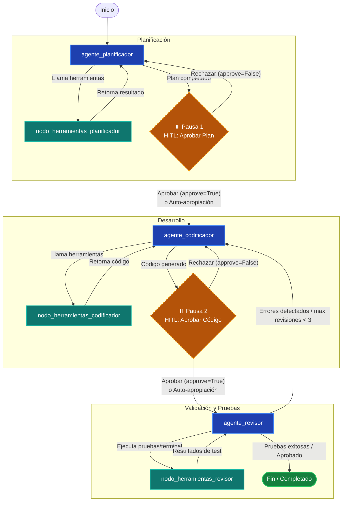

# AIDevTeam - Ecosistema de Agentes de Desarrollo IA

**AIDevTeam** is una plataforma avanzada de agentes autónomos diseñada para automatizar el ciclo de vida del desarrollo de software (SDLC). Utilizando **LangGraph** para la orquestación y el **Model Context Protocol (MCP)** para la interoperabilidad, AIDevTeam permite delegar tareas complejas de programación a un equipo virtual de expertos en IA.

---

## 🚀 Arquitectura del Sistema

El proyecto implementa un grafo cíclico de estados (`StateGraph`) utilizando la arquitectura de agentes de LangChain, permitiendo la colaboración en tiempo real y la corrección de errores en un flujo iterativo.

### Diagrama de Flujo del Ecosistema de Agentes

A continuación se muestra el diagrama de flujo que ilustra la arquitectura de estados, los nodos de agentes, las herramientas y los puntos de interrupción con intervención humana (Human-in-the-Loop) o auto-aprobación:



### Gestión de Estado, Enrutamiento Dinámico y Optimización de Contexto
- **Estado del Proyecto (`ProjectState`)**: Hereda de `MessagesState` de LangGraph, lo que permite la gestión automática del historial de mensajes (`messages`) entre los agentes y el usuario, además de mantener variables de estado globales como el plan de acción, los errores de terminal, contadores de control (`loop_counter`, `revision_count`) y el **índice del proyecto** (`project_index`).
- **Control de Flujo (`Command`)**: Se utiliza el objeto `Command` de LangGraph para el enrutamiento dinámico. Esto permite a cada agente decidir de manera autónoma cuál es el siguiente nodo a ejecutar (por ejemplo, ir a su nodo de herramientas, avanzar al siguiente agente o terminar el proceso) y actualizar el estado global de forma explícita.
- **Aristas Explícitas**: El grafo utiliza aristas explícitas para conectar los nodos de herramientas de vuelta a sus agentes correspondientes, asegurando un flujo de ejecución predecible y robusto.
- **Resumen Automático de Contexto (`app/utils/summarization.py`)**: Para prevenir el desbordamiento de la ventana de contexto de los modelos LLM en conversaciones largas o iterativas, se implementa la función `aplicar_resumen_middleware` utilizando `SummarizationMiddleware` de LangChain. Este componente evalúa el historial de mensajes antes de cada invocación al LLM y, al superar un umbral configurable (`trigger_count=15`), resume automáticamente los mensajes más antiguos conservando los últimos mensajes recientes (`keep_count=8`), asegurando una alta eficiencia de tokens en los agentes `agente_planificador`, `agente_codificador` y `agente_revisor`.

### 🧠 Índice de Proyecto con Caché Incremental (Optimización de Tokens)

Para evitar que los agentes lean el proyecto completo en cada implementación, el sistema construye un **Índice de Proyecto** (`app/utils/project_index.py`) que representa de forma compacta la estructura de directorios y los resúmenes de archivos (firmas, imports, docstrings, claves de configuración).

**Cómo funciona:**
1. Al iniciar una tarea nueva, `mcp_server.py` construye el índice del proyecto y lo inyecta en el estado (`project_index`).
2. El índice se **persiste en disco** en `<proyecto>/.project_index/.project_index.json` (ubicación configurable mediante `PROJECT_INDEX_CACHE_DIR`) y se **invalida incrementalmente** mediante una firma compuesta por `mtime_ns` (nanosegundos, para detectar cambios dentro del mismo segundo) + tamaño + `sha256`, de modo que solo se recalculan los archivos que realmente cambiaron.
3. Los agentes usan el índice como contexto inicial en lugar de explorar con `list_directory` + `read_file` repetidamente.
4. **Refresco automático tras escritura**: cada vez que el `nodo_herramientas_codificador` ejecuta las herramientas de escritura del Agente Codificador (`write_file`, `edit_file`, `copy_file`, `move_file`, `file_delete`), el índice se **refresca automáticamente** llamando a `actualizar_indice_incremental(directorio, project_index)` y la versión actualizada se fusiona de vuelta en el estado (`project_index`), garantizando que los agentes posteriores trabajen siempre con un índice coherente con el disco.

**Nuevas herramientas:**
- `get_project_index`: Devuelve el índice completo del proyecto (estructura + resúmenes). El Planificador la llama UNA vez al inicio.
- `read_file_summary`: Devuelve SOLO el resumen de un archivo (firmas, imports, docstrings) en lugar del contenido completo. El Codificador y Revisor la usan para inspección.

**Configuración (`.env`):**
```env
PROJECT_INDEX_ENABLED="true"
PROJECT_INDEX_MAX_TOKENS_PER_FILE="400"
PROJECT_INDEX_CACHE_DIR=".project_index"
```

**Beneficio:** La exploración del Planificador pasa de decenas de `read_file` a 1 llamada `get_project_index`, y el Codificador/Revisor reducen cada lectura completa a un resumen de ~400 tokens, con caché persistente entre tareas.

---

## 🤖 Roles y Responsabilidades de los Agentes (`app/agents/`)

El equipo de IA está compuesto por tres agentes especializados, cada uno con un rol definido dentro del ciclo de desarrollo:

1. **Agente Planificador (`agente_planificador.py`)**:
   - Actúa como Arquitecto de Software. Analiza la solicitud del usuario, investiga librerías y documentación mediante la herramienta de búsqueda web **DuckDuckGo** (`busqueda_web_duckduckgo`) y diseña un **Plan de Acción** estructurado (`PlanDeAccion`) dividido en tareas atómicas (`archivo`, `tarea`, `requiere_test`).
   - Gestiona un contador de bucles interno (máximo 15 iteraciones) para evitar bucles infinitos de planificación.

2. **Agente Codificador (`agente_codificador.py`)**:
   - Actúa como Programador Senior. Recibe el plan de acción aprobado y desarrolla el código fuente utilizando herramientas de manipulación y creación de archivos en el sistema de ficheros.
   - Si se rechaza una propuesta o se recibe feedback correctivo, analiza los comentarios del usuario o del Revisor y realiza los ajustes necesarios en el código.
   - Gestiona un contador de bucles interno (máximo 15 iteraciones).

3. **Agente Revisor (`agente_revisor.py`)**:
   - Actúa como Ingeniero de Control de Calidad (QA) y DevOps. Ejecuta el código desarrollado y las pruebas automatizadas en la terminal utilizando la `ShellTool`.
   - **Optimización de Verificación Rápida**: Si ningún paso del plan de acción requiere pruebas (`requiere_test=False` en todos los pasos), el Revisor **aprueba automáticamente** el trabajo sin invocar comandos de shell innecesarios.
   - **Ciclo de Feedback**: Si encuentra errores de sintaxis o fallas en las pruebas, re-enruta el flujo de vuelta al Agente Codificador con el informe detallado de errores, soportando hasta un **máximo de 3 revisiones** (`revision_count >= 3`) para converger hacia una solución limpia y funcional.

---

## 🏭 Factoría de Modelos LLM (`app/models/llm_factory.py`)

El módulo `app/models/llm_factory.py` proporciona inicialización centralizada y agnóstica de los modelos de lenguaje a través de la función `init_chat_model` de LangChain.

- **Compatibilidad Multi-Proveedor**:
  - **Google (Gemini)**: Soporta modelos como `gemini-2.5-flash-lite`, `gemini-1.5-pro`, etc.
  - **OpenAI**: Soporta modelos GPT-4o, GPT-4o-mini, etc.
  - **Anthropic**: Soporta modelos Claude 3.5 Sonnet, etc.
  - **OpenRouter**: Permite acceder a una amplia gama de modelos de código abierto y cerrados (ej. `nvidia/nemotron-3-super-120b-a12b:free`, `step-3.5-flash`).
  - **Ollama / Local**: Permite la ejecución de modelos locales (ej. `gemma4:e2b`) sin depender de APIs en la nube.
- **Configuración Dinámica y Sistema Multi-Modelo**: 
  - Valida y extrae credenciales, proveedores y parámetros mediante `pydantic-settings` (`app/settings/settings.py`), permitiendo alternar entre proveedores de manera transparente.
  - **Soporte Multi-Modelo Granular por Agente**: AIDevTeam permite configurar de forma independiente el proveedor, el modelo y la clave de API para cada uno de los agentes especializados del ecosistema (`agente_planificador`, `agente_codificador`, `agente_revisor`). 
  - Si no se definen variables específicas para un agente, el sistema utiliza automáticamente las variables globales predeterminadas (`LLM_PROVIDER`, `LLM_MODEL`, `LLM_API_KEY`) como mecanismo de *fallback*.

---

## 🔌 Servidor MCP (`mcp_server.py`)

Implementado utilizando **FastMCP**, el servidor expone capacidades avanzadas para la integración de agentes de IA con entornos de desarrollo y asistentes externos.

### Herramientas Disponibles

#### 1. `delegar_tarea_a_equipo_ia` (Herramienta Principal)

Única herramienta expuesta públicamente para clientes MCP. Delega tareas a 3 agentes autónomos (Arquitecto, Programador, QA) vía grafo LangGraph.

**Parámetros:**

| Parámetro | Tipo | Requerido | Descripción |
|-----------|------|-----------|-------------|
| `instruccion` | `string` | **Sí** | Qué construir, o feedback si se rechaza plan/código. |
| `directorio_proyecto` | `string` | **Sí** | Ruta absoluta del proyecto. |
| `approve` | `boolean` | No (default: `false`) | Aprobar y continuar si pausado (Pausa 1 o 2). |
| `tarea_id` | `string` | No* | **Obligatorio** si `approve=true` o reanudando. ID sesión (ej. `task_a1b2c3d4`). Vacío para tarea nueva. |
| `auto_approve` | `boolean` | No (default: `false`) | Auto-aprueba pausas sin confirmación manual. También vía `MCP_AUTO_APPROVE="true"`. |

**Flujo:**
1. **Nueva tarea** (`tarea_id` vacío, `approve=false`): Genera ID, invoca Planificador → **Pausa 1 (HITL)**.
2. **Pausa 1 - Plan** (`siguiente_nodo == "agente_codificador"`): Retorna Markdown con plan, tabla pasos, instrucciones. **IA DEBE DETENERSE y mostrar al usuario.**
3. **Aprobar Plan** (`approve=true`, `tarea_id`): Reanuda → Codificador escribe código → **Pausa 2 (HITL)**.
4. **Pausa 2 - Código** (`siguiente_nodo == "agente_revisor"`): Retorna Markdown con resumen, `git diff`, instrucciones. **IA DEBE DETENERSE y mostrar al usuario.**
5. **Aprobar Código** (`approve=true`, `tarea_id`): Reanuda → Revisor (QA) ejecuta tests. Errores → Codificador (máx 3 rev). Éxito → **Completado**.
6. **Rechazo** (`approve=false` + feedback en `instruccion`): Pausa 1 → Planificador; Pausa 2 → Codificador (reinicia contadores).
7. **Auto-aprobación** (`auto_approve=true` o `MCP_AUTO_APPROVE=true`): Flujo automático sin pausas.

**Respuesta:** En pausas: Markdown completo. Al completar: resumen final con `tarea_id`, cambios, tests, `git diff`. Error: mensaje descriptivo.

---

#### 2. `visualizar_cambios` (Función Interna - **NO EXPUESTA COMO HERRAMIENTA MCP**)

> ⚠️ **Nota**: Ya no está expuesta como herramienta MCP. Función auxiliar interna para consultar estado de tarea o cambios en disco.

**Uso interno:** Consultar estado tarea pausada (`tarea_id`), obtener `git diff`/`git status`, recuperar `codigo_escrito`.

**Parámetros internos:** `tarea_id`, `directorio_proyecto` (opcional), `ctx`.

---

### Características Transversales

- **Auto-Aprobación**: Global (`MCP_AUTO_APPROVE="true"`) o por tarea (`auto_approve=True`).
- **Notificaciones Progreso**: Tiempo real con formato `[XX%]`, compatible `progressToken`, fallback `[XX%]` si no hay token. Timeout configurable (`MCP_TASK_TIMEOUT_SECONDS`, default 300s).
- **Inspección Cambios**: `git diff`/`git status` automático en pausas y fin. Detecta si Codificador omitió escritura.

### Transporte del Servidor (stdio / SSE)

El servidor MCP soporta dos modos de transporte, seleccionables mediante la variable de entorno `FASTMCP_TRANSPORT`:

| Transporte | Variable | Uso |
|-----------|----------|-----|
| **stdio** (por defecto) | `FASTMCP_TRANSPORT=stdio` | Recomendado para clientes que lanzan el proceso localmente (Zoo Code, Cursor, CLI). |
| **SSE** | `FASTMCP_TRANSPORT=sse` | Para visualización en tiempo real vía HTTP. Requiere `FASTMCP_HOST` y `FASTMCP_PORT`. |

**Ejemplo de arranque en modo SSE:**
```bash
FASTMCP_TRANSPORT=sse FASTMCP_HOST=127.0.0.1 FASTMCP_PORT=8000 python mcp_server.py
```

> ⚠️ **Importante**: El error `MCP error -32000: Connection closed` en Zoo Code suele deberse a que el proceso del servidor se cierra al iniciar porque los imports relativos (`app.main`, `app.utils`, etc.) fallan cuando el cliente lanza el proceso desde un directorio de trabajo distinto al del proyecto. Para evitarlo, el servidor agrega automáticamente su propio directorio a `sys.path` y se recomienda configurar `cwd` en el `mcp_settings.json` del cliente apuntando a la raíz del proyecto.

---

### Ejemplo Uso (Cliente MCP)

```json
{
  "tool": "delegar_tarea_a_equipo_ia",
  "arguments": {
    "instruccion": "Crea API REST FastAPI CRUD usuarios, SQLite, SQLAlchemy, tests pytest.",
    "directorio_proyecto": "/home/usuario/mi_proyecto",
    "approve": false,
    "auto_approve": false
  }
}
```

**Respuesta Pausa 1:** Markdown con plan, tabla pasos, instrucciones "Aprobar"/"Rechazar".

**Para aprobar:**
```json
{
  "tool": "delegar_tarea_a_equipo_ia",
  "arguments": {
    "instruccion": "Aprobar",
    "directorio_proyecto": "/home/usuario/mi_proyecto",
    "approve": true,
    "tarea_id": "task_a1b2c3d4"
  }
}
```

---

## 🧪 Pruebas Automatizadas (`tests/`)

El proyecto incluye una suite completa de pruebas unitarias, de integración y End-to-End construida con `pytest` y `pytest-mock`.

### Módulos de Prueba
- `tests/test_agents.py`: Valida el comportamiento individual de los agentes (planificador, codificador y revisor).
- `tests/test_e2e.py`: Pruebas End-to-End del ciclo completo del grafo bajo escenarios simulados.
- `tests/test_files.py`: Verifica la utilidad de lectura y manipulación de archivos y system prompts.
- `tests/test_integration.py`: Comprueba la correcta interacción entre nodos, aristas y herramientas de LangGraph.
- `tests/test_llm_factory.py`: Valida la inicialización correcta de la factoría de LLMs para múltiples proveedores.
- `tests/test_mcp_server.py`: Prueba los endpoints y herramientas expuestas por el servidor FastMCP.
- `tests/test_tool_nodes.py`: Verifica la correcta ejecución de los nodos de herramientas.
- `tests/test_summarization.py`: Valida el comportamiento del middleware de resumen automático de contexto (`aplicar_resumen_middleware`), comprobando la preservación del historial por debajo del umbral (`trigger_count`) y el resumen correcto al superarlo.

### Ejecución de Pruebas y Linter
El script `./run_tests.sh` automatiza la ejecución de toda la suite de pruebas junto con el análisis estático de código utilizando `flake8`:

```bash
# Ejecutar todas las pruebas unitarias y linter
./run_tests.sh

# Ejecutar incluyendo las pruebas End-to-End (E2E)
./run_tests.sh --e2e
```

---

## 📁 Estructura del Proyecto

```text
.
├── .env                    # Variables de entorno
├── .gitignore              # Archivos ignorados por git
├── checkpoints.sqlite      # Base de datos de persistencia (MemorySaver)
├── LICENSE                 # Licencia del proyecto
├── mcp_server.py           # Punto de entrada para el servidor FastMCP
├── README.md               # Documentación completa del proyecto
├── requirements.txt        # Dependencias de Python
├── run_tests.sh            # Script automatizado de pruebas y linter
├── tech-lead-export.yaml   # Perfil personalizado "Tech Lead" para Zoo Code
├── app/                    # Código fuente principal
│   ├── agents/             # Lógica de agentes especializados
│   │   ├── agente_codificador.py
│   │   ├── agente_planificador.py
│   │   ├── agente_revisor.py
│   │   └── __init__.py
│   ├── models/             # Esquemas de datos y fábrica de LLMs
│   │   ├── llm_factory.py
│   │   └── models.py
│   ├── prompts/            # System Prompts en Markdown
│   │   ├── codificador_prompt.md
│   │   ├── planificador_prompt.md
│   │   └── revisor_prompt.md
│   ├── settings/           # Configuración dinámica con pydantic-settings
│   │   ├── settings.py
│   │   └── __init__.py
│   └── utils/              # Utilidades auxiliares
│       ├── files.py
│       ├── project_index.py # Índice de proyecto con caché incremental (optimización de tokens)
│       └── summarization.py # Utilidad de resumen automático de contexto
│   └── main.py             # Orquestador principal del Grafo (StateGraph)
└── tests/                  # Suite de pruebas automatizadas
    ├── conftest.py         # Configuración y fixtures compartidas de pytest
    ├── test_agents.py      # Pruebas de agentes
    ├── test_e2e.py         # Pruebas End-to-End
    ├── test_files.py       # Pruebas de utilidades de archivos
    ├── test_integration.py # Pruebas de integración LangGraph
    ├── test_llm_factory.py # Pruebas de la factoría de LLMs
    ├── test_mcp_server.py  # Pruebas del servidor MCP
    ├── test_project_index.py # Pruebas del índice de proyecto
    ├── test_summarization.py # Pruebas unitarias de resumen de contexto
    └── test_tool_nodes.py  # Pruebas de nodos de herramientas
```

---

## 🛠️ Instalación y Configuración

### 1. Requisitos Previos
- Python 3.10 o superior.

### 2. Configuración del Entorno
```bash
git clone <repository-url>
cd copilot_support
python -m venv .venv
source .venv/bin/activate
pip install -r requirements.txt
```

### 3. Variables de Entorno (.env)
Crea un archivo `.env` en la raíz. Puedes configurar un modelo global por defecto o utilizar el sistema **multi-modelo granular** para asignar proveedores y modelos específicos a cada agente:

```env
# ==========================================
# Configuración Global por Defecto (Fallback)
# ==========================================
LLM_API_KEY="tu_llm_api_key"
LLM_PROVIDER="google"
LLM_MODEL="gemini-2.5-flash-lite"

# ==========================================
# Configuración Multi-Modelo por Agente (Opcional)
# ==========================================
# 1. Agente Planificador (Arquitecto de Software)
PLANNER_PROVIDER="anthropic"
PLANNER_MODEL="claude-3-5-sonnet"
PLANNER_API_KEY="tu_anthropic_api_key"

# 2. Agente Codificador (Programador Senior)
CODER_PROVIDER="openai"
CODER_MODEL="gpt-4o"
CODER_API_KEY="tu_openai_api_key"

# 3. Agente Revisor (QA & DevOps)
REVIEWER_PROVIDER="openrouter"
REVIEWER_MODEL="nvidia/nemotron-3-super-120b-a12b:free"
REVIEWER_API_KEY="tu_openrouter_api_key"

# ==========================================
# Configuración del Servidor MCP y Control
# ==========================================
MCP_AUTO_APPROVE="true"
MCP_TASK_TIMEOUT_SECONDS="300"

# ==========================================
# Índice de Proyecto (Optimización de Tokens)
# ==========================================
PROJECT_INDEX_ENABLED="true"
PROJECT_INDEX_MAX_TOKENS_PER_FILE="400"
PROJECT_INDEX_CACHE_DIR=".project_index"
```

---

## 🔌 Integración con MCP y Zoo Code

### Configuración del Servidor MCP (`mcpServers`)
```json
{
  "mcpServers": {
    "AIDevTeam": {
      "command": "/ruta/a/copilot_support/.venv/bin/python",
      "args": [
        "/ruta/a/copilot_support/mcp_server.py"
      ],
      "env": {
        "LLM_API_KEY": "tu_api_key",
        "LLM_MODEL": "gemini-2.5-flash-lite",
        "LLM_PROVIDER": "google",
        "PLANNER_PROVIDER": "anthropic",
        "PLANNER_MODEL": "claude-3-5-sonnet",
        "PLANNER_API_KEY": "tu_anthropic_api_key",
        "CODER_PROVIDER": "openai",
        "CODER_MODEL": "gpt-4o",
        "CODER_API_KEY": "tu_openai_api_key",
        "REVIEWER_PROVIDER": "openrouter",
        "REVIEWER_MODEL": "nvidia/nemotron-3-super-120b-a12b:free",
        "REVIEWER_API_KEY": "tu_openrouter_api_key",
        "FASTMCP_LOG_LEVEL": "CRITICAL",
        "MCP_AUTO_APPROVE": "true",
        "MCP_TASK_TIMEOUT_SECONDS": "300"
      },
      "alwaysAllow": [
        "delegar_tarea_a_equipo_ia"
      ],
      "timeout": 600
    }
  }
}
```

### Integración con Zoo Code
El archivo `tech-lead-export.yaml` define un "Custom Mode" (Tech Lead) para Zoo Code (y extensiones compatibles), permitiendo que el asistente actúe como gestor de proyectos y delegue el trabajo pesado de codificación al equipo de IA a través del servidor MCP.

---

## 🛡️ Términos de Uso

Este servidor MCP se distribuye bajo un modelo de **Código Visible (Source Available)** para fines no comerciales. Se permite el acceso al código fuente para su auditoría, aprendizaje y uso privado.

Queda estrictamente prohibida la explotación comercial, venta o redistribución de este software como parte de un producto o servicio de pago sin autorización previa por escrito del autor.

---
© 2026 AIDevTeam - Automatización Inteligente de Software.
