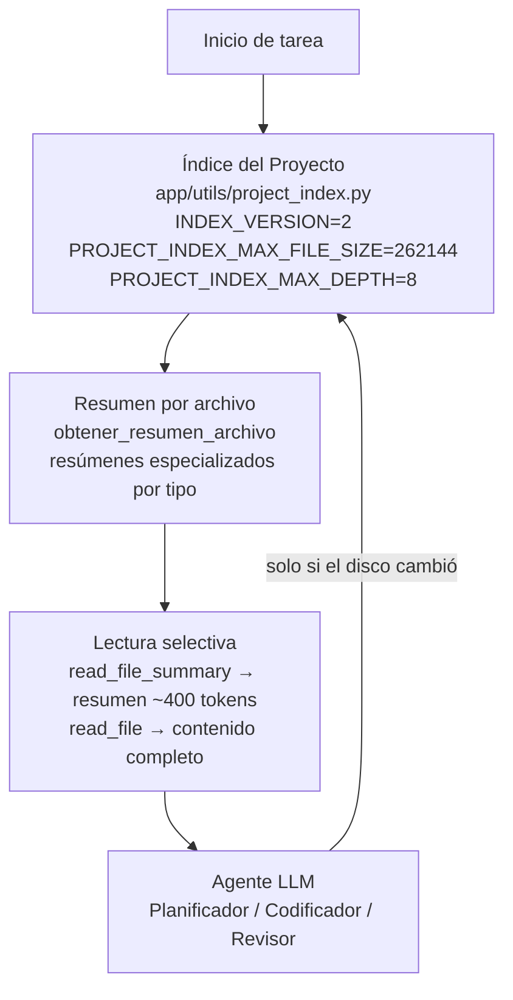

# Ahorro de Tokens: Índice de Proyecto y Lectura Selectiva

## 1. Propósito

Este documento explica cómo el sistema evita leer el proyecto completo en cada
tarea, reduciendo el consumo de tokens de los LLM (Planificador, Codificador y
Revisor). El mecanismo central es un **Índice de Proyecto con caché
incremental** que construye una representación compacta del árbol de
directorios y de cada archivo (resúmenes especializados), de modo que los
agentes solo leen el contenido completo de un archivo cuando es estrictamente
necesario.

El resultado es un ahorro significativo de tokens por tarea: en lugar de
decenas de lecturas completas (`read_file`), los agentes trabajan con
resúmenes de ~400 tokens por archivo (`read_file_summary`) y con el índice
global del proyecto, que se persiste entre tareas y se invalida
incrementalmente.

## 2. Diagrama de flujo de ahorro de tokens

**Detalle de cada nodo:**

- **Nodo 1 — Índice del Proyecto** (`app/utils/project_index.py`):
  - `INDEX_VERSION = 2` (versión del formato del índice; al cambiar, se
    reconstruye desde cero).
  - `PROJECT_INDEX_MAX_FILE_SIZE = 262144` (bytes) y
    `PROJECT_INDEX_MAX_DEPTH = 8` (niveles de profundidad del árbol).
  - El índice se persiste en `.project_index/.project_index.json` y se
    invalida **incrementalmente** con la firma `sha256 + mtime_ns + tamaño`:
    solo se recalculan los archivos que realmente cambiaron, no todo el árbol.

- **Nodo 2 — Resumen por archivo** (función `obtener_resumen_archivo` en
  `app/utils/project_index.py`): genera resúmenes **especializados por tipo**:
  - Código fuente (`.py`, `.js`, `.ts`, ...) → imports + firmas + docstrings.
  - Configuración (`.json`, `.yaml`, `.toml`, `.env`, ...) → claves.
  - Documentación (`.md`, `.rst`, ...) → encabezados.
  - Binarios y lockfiles excluidos (`EXCLUDED_DIRS`, `EXCLUDED_FILES`,
    `BINARY_EXTENSIONS`).

- **Nodo 3 — Lectura selectiva**: dos herramientas complementarias:
  - `read_file_summary`: devuelve **solo** el resumen del archivo
    (~400 tokens por archivo, límite `PROJECT_INDEX_MAX_TOKENS_PER_FILE`).
  - `read_file`: devuelve el contenido completo, **solo** cuando el resumen
    es insuficiente (p. ej. para modificar el cuerpo de una función).

- **Nodo 4 — Agente LLM** (Planificador / Codificador / Revisor): consume el
  índice y los resúmenes. La flecha de retorno al Nodo 1 indica que el índice
  solo se refresca **si el disco cambió** (refresco automático tras
  `write_file`, `edit_file`, `copy_file`, `move_file` o `file_delete`).

## 3. Settings configurables

Todas las variables se leen desde el entorno (`.env`) en
`app/settings/settings.py` y se pueden ajustar sin tocar código:

| Variable | Default | Descripción | Dónde afecta |
|---|---|---|---|
| `PROJECT_INDEX_MAX_DEPTH` | 8 | Profundidad máxima del árbol de directorios indexado | `app/utils/project_index.py` |
| `PROJECT_INDEX_MAX_FILE_SIZE` | 262144 | Tamaño máximo en bytes de un archivo para ser indexado | `app/utils/project_index.py` |
| `TERMINAL_MAX_OUTPUT_LINES` | 200 | Límite de líneas de salida de la terminal | `app/utils/terminal.py` (ShellTool del Revisor) |
| `TERMINAL_MAX_CHARS_PER_LINE` | 500 | Límite de caracteres por línea de salida | `app/utils/terminal.py` |
| `GIT_DIFF_MAX_FILE_SIZE` | 1048576 | Tamaño máximo en bytes del diff por archivo | `app/mcp/git_utils.py` (`obtener_git_diff`) |

> **NOTA:** Los defaults actuales en `app/settings/settings.py` para
> `PROJECT_INDEX_MAX_FILE_SIZE` y `PROJECT_INDEX_MAX_DEPTH` son **1048576** y
> **5** respectivamente; los valores **262144** y **8** son los
> recomendados/objetivo documentados en esta spec. Todas las variables se
> sobreescriben por `.env`.

## 4. Persistencia del checkpointer en SQLite

El estado del grafo LangGraph (`ProjectState`) se persiste en
`checkpoints.sqlite` en la raíz del proyecto mediante `SqliteSaver`
(`app/main.py`). Esto permite **reanudar tareas interrumpidas sin perder
contexto**: cada nodo del grafo (Planificador → Codificador → Revisor) guarda
su estado en el checkpoint, de modo que un reinicio del servidor MCP no
descarta el progreso acumulado.

El archivo `checkpoints.sqlite` está incluido en `.gitignore`, por lo que no
se versiona en el repositorio.

## 5. Umbrales del planificador (`app/agents/agente_planificador.py`)

| Variable | Valor | Descripción |
|---|---|---|
| `MAX_ITERACIONES_PLANIFICADOR` | 25 | Límite máximo de iteraciones del bucle del Planificador (aumentado de 15 a 25 para análisis que requieren varias lecturas). |
| `UMBRAL_INSTAR_CIERRE_ANALISIS` | 10 | En modo análisis, al alcanzarlo se instruye al LLM a cerrar la exploración y redactar el informe final. |
| `UMBRAL_FORZAR_ENTREGA_ANALISIS` | 20 | Umbral duro: si el LLM sigue pidiendo herramientas de lectura, se fuerza la entrega del análisis con el contexto acumulado (una única llamada LLM sin herramientas). |

## 6. Garantía: NO se lee el proyecto completo en cada tarea

El sistema garantiza que el proyecto **no se lee completo** en cada tarea,
gracias a las siguientes medidas:

1. **(a)** El Planificador llama a `get_project_index` **una vez** al inicio,
   en lugar de ejecutar decenas de `read_file` para explorar la estructura.
2. **(b)** El Codificador y el Revisor usan `read_file_summary` para la
   inspección y `read_file` **solo cuando es imprescindible** (p. ej. para
   modificar el cuerpo exacto de una función o clase).
3. **(c)** Caché persistente entre tareas en
   `.project_index/.project_index.json` con invalidación incremental por hash
   (`sha256 + mtime_ns + tamaño`): solo se recalculan los archivos cambiados.
4. **(d)** Refresco automático del índice tras cada escritura del Codificador
   (`write_file`, `edit_file`, `copy_file`, `move_file`, `file_delete`).
5. **(e)** Resumen automático de contexto (`SummarizationMiddleware`,
   `trigger_count=15`, `keep_count=8`) como capa adicional de ahorro: cuando
   el historial de mensajes supera el umbral, se compacta el contexto antiguo
   conservando los últimos mensajes relevantes.